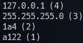

  
<h1>「強力な空間切断系の魔法」</h1>

  
<h3>※ 魔法レイルザイデンを言葉の比喩として使用しました。</h3>

  
<u>外部プロジェクトのシェルに<a href="https://github.com/takkii/golden_eagle/tree/main/wiki">PATH</a>を通してください。</u>

  

  
<h2><u>railseiden newworld.log</u></h2>

  
<h3>生成されるeffect.txtの内容</h3>

  

  <table style=".my-table th; .my-table td border: 0.5vw solid #999;">
  <tr><th>127.0.0.1</th><td>4箇所</td></tr>
  <tr><th>255.255.255.0</th><td>3箇所</td></tr>
  <tr><th>1a4</th><td>2箇所</td></tr>
  <tr><th>a122</th><td>1箇所</td></tr>
  <tr><th>undefined</th><td>1箇所</td></tr>
  </table>

   
<h3><u>※ データ分析(集計)の結果をeffect.txtに書き込みます。</u></h3>

   
<h2><u>clarify.py effect.txt 0 15</u></h2>

   
<h3><u>※ 引数で指定した先頭から15行目まで、effect.txtの内容を表示します。</u></h3>

